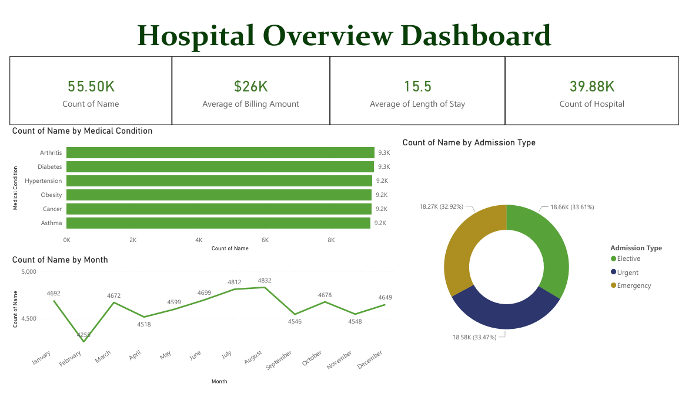
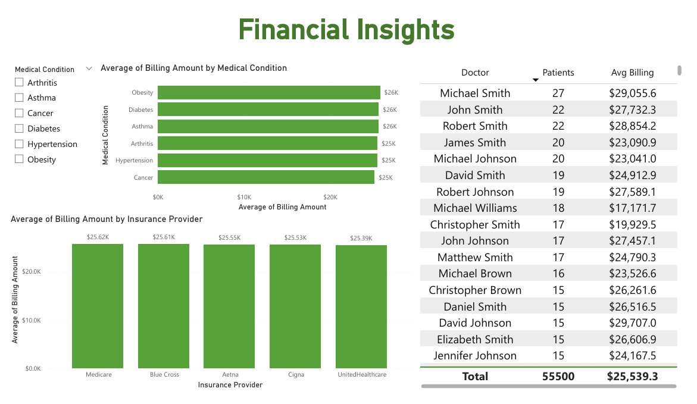
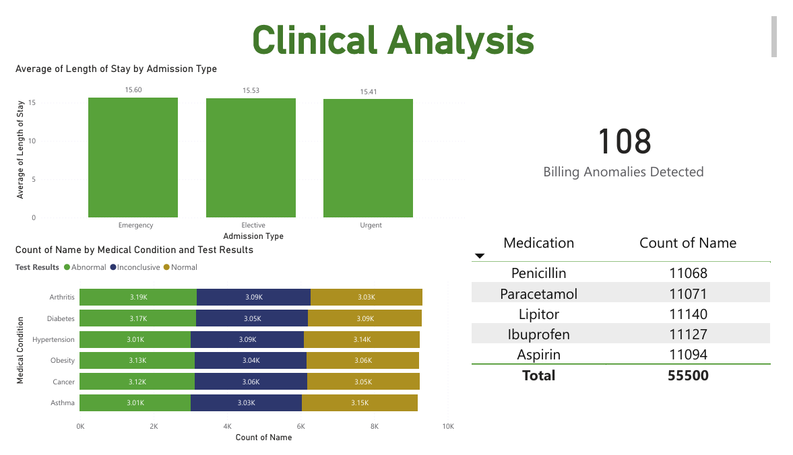

# Hospital Emergency Department Analytics

Analyzed 55,500+ patient records to identify operational bottlenecks and billing patterns using Python, MySQL, and Power BI.

## Problem
Hospitals lack visibility into patient flow, billing trends, and resource allocation, leading to operational inefficiencies.

## Tools Used
- **Python** (pandas) — Data cleaning and feature engineering
- **MySQL** — Complex queries with CTEs and window functions  
- **Power BI** — Interactive dashboard with 10+ visualizations

## Key Findings

**Financial**
- Average billing: **$25,539** per patient
- Obesity treatment has highest avg billing ($26K+)
- **108 billing anomalies** detected (negative amounts)

**Operational**  
- Average length of stay: **15.5 days**
- Emergency admissions: 33% of total volume
- Peak months: January and July

**Clinical**
- **33.6% abnormal test results** requiring follow-up
- Paracetamol most prescribed medication (20%)

## Technical Work

**Data Cleaning:**
- Fixed capitalization in 55K patient names
- Created derived features: Length of Stay, Age Groups
- Flagged 108 billing anomalies

**SQL Analysis:**
- 8 queries using window functions (RANK, PARTITION BY)
- Medical condition and insurance analysis
- Doctor performance ranking
- Monthly trend analysis

**Dashboard:**
- 3-page Power BI dashboard with 10+ visualizations
- Financial, operational, and clinical insights
- Professional formatting and layout

## Dashboard Preview







## Recommendations
1. Audit 108 billing anomalies immediately
2. Standardize follow-up for abnormal test results
3. Optimize staffing for Jan/July peaks

## Project Structure
```
hospital-ed-analytics/
├── data/          # Sample dataset
├── notebooks/     # Python cleaning
├── sql/          # MySQL queries
└── dashboard/    # Power BI files
```

## Dataset
- **Size:** 55,500 patient records (2019-2024)
- **Attributes:** 15 columns including demographics, medical condition, billing, dates, test results
- **Source:** Kaggle Healthcare Dataset [https://www.kaggle.com/datasets/prasad22/healthcare-dataset]
